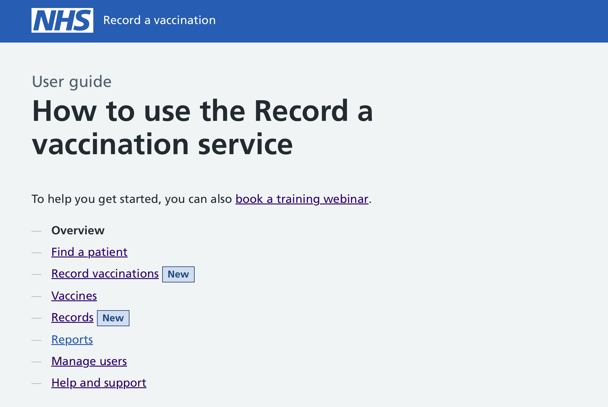
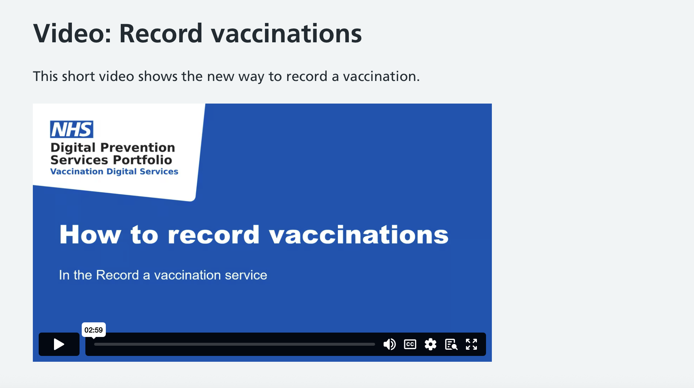
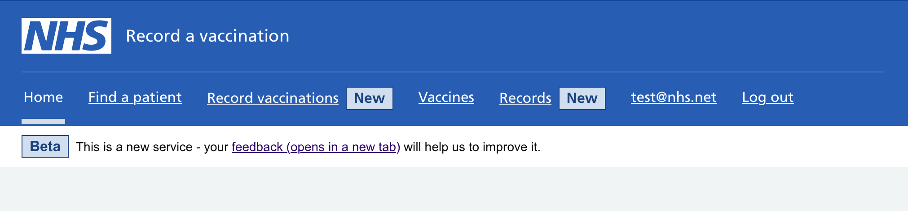
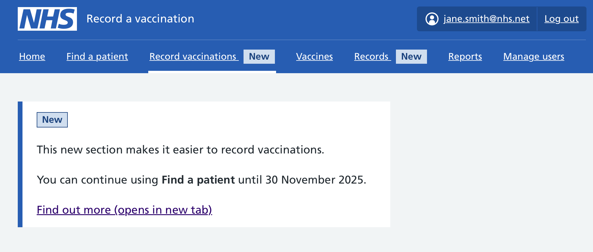

For the autumn 2025 winter vaccination we made some major changes to the interface for recording and editing vaccination records.

Whilst we were confident that the new interface would be simpler and easier to use, we know that changing things can be disconcerting, and some users may want reassurance.

Here’s how we tried to resolve this by providing users with additional communications and guidance, and by allowing a 2 month period of dual-running of the old and new interfaces side-by-side.

## Getting ready

On 26 August 2025 we sent all users an email with the subject line ‘Get ready for autumn vaccinations’.

This email contained a checklist of tasks for users to do, such as checking they can still log in, reactivating any users, and setting up their vaccine batches.

It also contained a section which mentioned some changes coming soon:

## The week before

On 25 September 2025 we sent all users a second email, this time purely focused on the new interface and containing some further details.

![Screenshot of an email with the content: Dear FirstName LastName. In the first week of October, we're adding 2 new sections to RAVS: 1. 'Record vaccinations' will offer a simpler, quicker way to record vaccinations. 2. 'Records' will allow you to easily view and edit vaccination records. The current 'Find a patient' section will still be available for recording vaccinations and editing records until 30 November 2025. Find out more. Watch a video and read our updated guidance: Record vaccinations includes a short video plus a description of what you'll be asked and what has changed. Records describes how you can find and edit vaccination records. Kind regards,NHS Record a vaccination](new-way-to-record-vaccinations-email.png)

The email linked to 2 new pages in our [user guide](http://guide.ravs.england.nhs.uk) which described the 2 new sections.

On the contents list for the user guide, the sections have a ‘New’ tag to help make them stand out.

The guidance page for Record vaccinations also contained a short video which shows how the recording journey for the new section works.

## On launch

On the 29 September 2025, we launched the new interface for all users.

We made the decision to not initially remove the old interface, which is labelled ‘Find a patient’. Instead, both the old and the new interfaces are available at the same time.

The new sections are highlighted with ‘New’ tags in the header:

Making both interfaces for recording vaccinations available at the same time has the potential to cause confusion, but we hope that it gives users more flexibility on when to switch over to the new interface, rather than having to do it unexpectedly.

## Future plans

We plan to retire the old ‘Find a patient’ interface on 30 November 2025.

This date has been included in the guidance site, and we plan to additionally communicate it within the service by adding a panel to the top of each section:

We may send some additional emails to alert users of the removal of the old interface if needed, depending on what our analytics show for how many of them have already switched over.

After 30 November, we also will remove the ‘New’ tags from the header, and remove the guidance page for the old interface.

