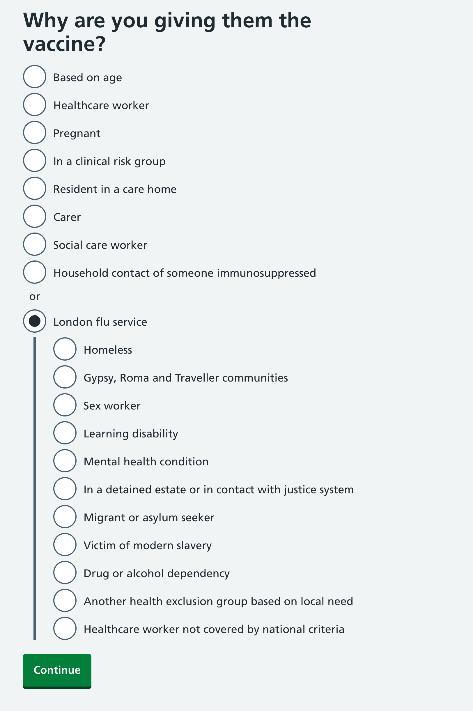
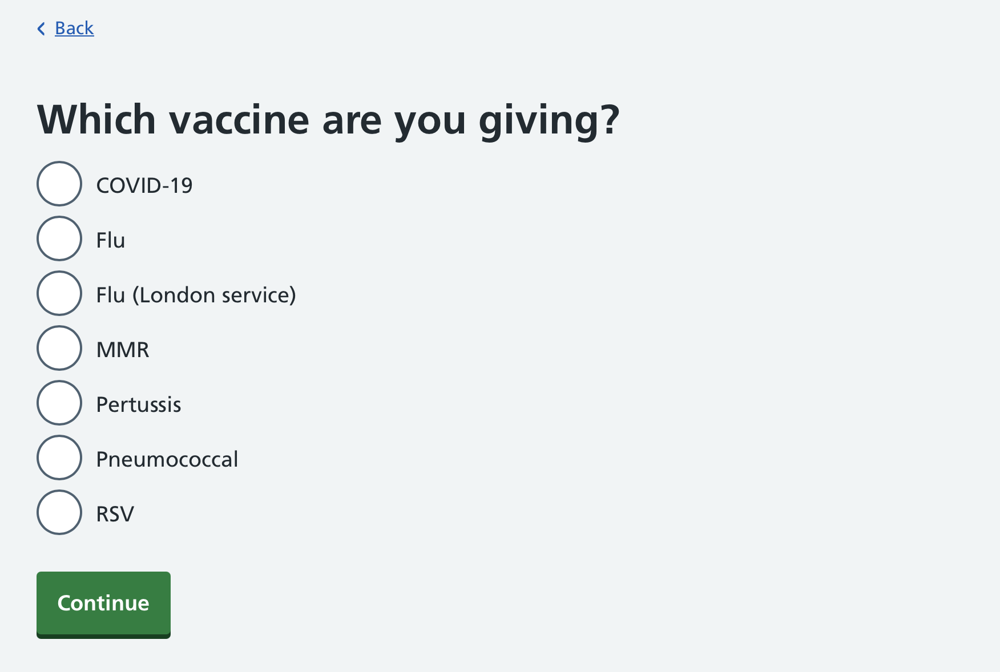
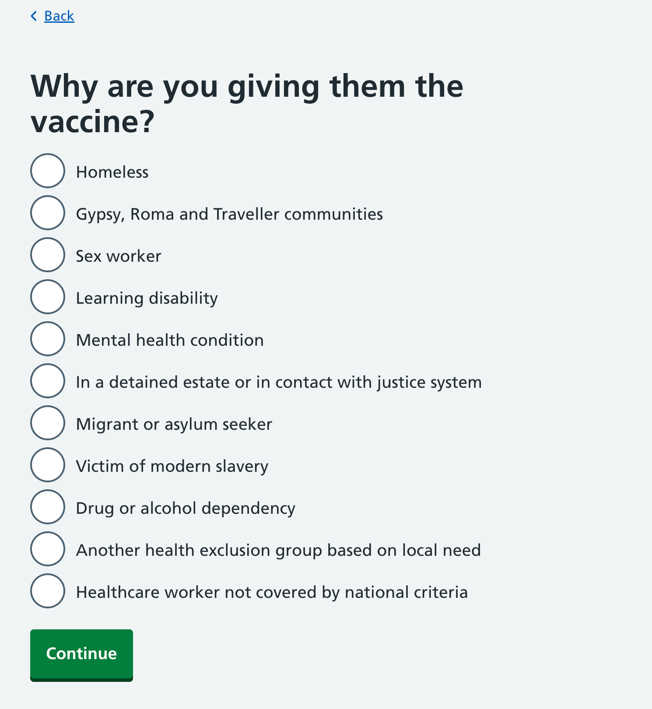

From the 1 October 2025, RAVS is also supporting the London flu service.

This is an additional serviced funded by the NHS London region which enables pharmacies to offer the flu vaccination to some additional at-risk groups not covered by the national flu eligibility criteria.

The additional groups are:

* Homeless
* Gypsy, Roma and Traveller communities
* Sex worker
* Learning disability
* Mental health condition
* In a detained estate or in contact with justice system
* Migrant or asylum seeker
* Victim of modern slavery
* Drug or alcohol dependency
* Another health exclusion group based on local need
* Healthcare worker not covered by national criteria

Here’s how we added support for this in the service.

## Initial design

Given that the vaccine used for the London flu service is identical to that used by the national flu vaccination campaign, our starting point was to keep the interface exactly the same, but to offer some additional eligibility criteria which can be selected.

This was also motivated by the numbered from last season, which showed that even for pharmacies taking part in the London flu service, the vast majority of their flu vaccinations were still given under the national eligibility.

The additional categories would be revealed when selecting a ‘London flu service’ option:

## Technical constraints

When developing this design, we came across a technical constraint.

Our current database model assumes that each vaccination type (like flu) has a single SNOMED code and a single set of eligibility criteria.

Not only does the London flu service have some additional criteria for the flu vaccine (which only apply in London), it is also required to be reported under a different SNOMED code. The way that pharmacies are reimbursed also differs, as the London flu service is not supported by the API from the NHS Business Services Authority (BSA).

## The design we shipped

Due to time constraints, we changed the design so that the London flu service is treated as an entirely separate vaccination type.

This is how it appears when selecting which vaccine to record:

If the 'Flu (London service)' option is selected, the eligibility screen shows just the criteria for that service:

## Known issues

The biggest issue with treating the London flu service as a separate vaccine type from the national flu service is that it means that pharmacies will have to add the batch numbers and expiry dates for the vials they have in stock twice.

It also means that pharmacies will have to remember the different eligibility criteria and select the right service up front, rather than being able to see them all on a single screen.

## Future considerations

We plan to learn more about how the London flu service operates, and to learn about how much of an issue the design is in practice.

We would also like to understand more about how pharmacies assess the eligibility criteria for the London flu service, and how people included in the additional criteria know that the service is available to them.

In the longer term, we plan to update our database model in order to allow for regional and other differences for the same vaccine type.
