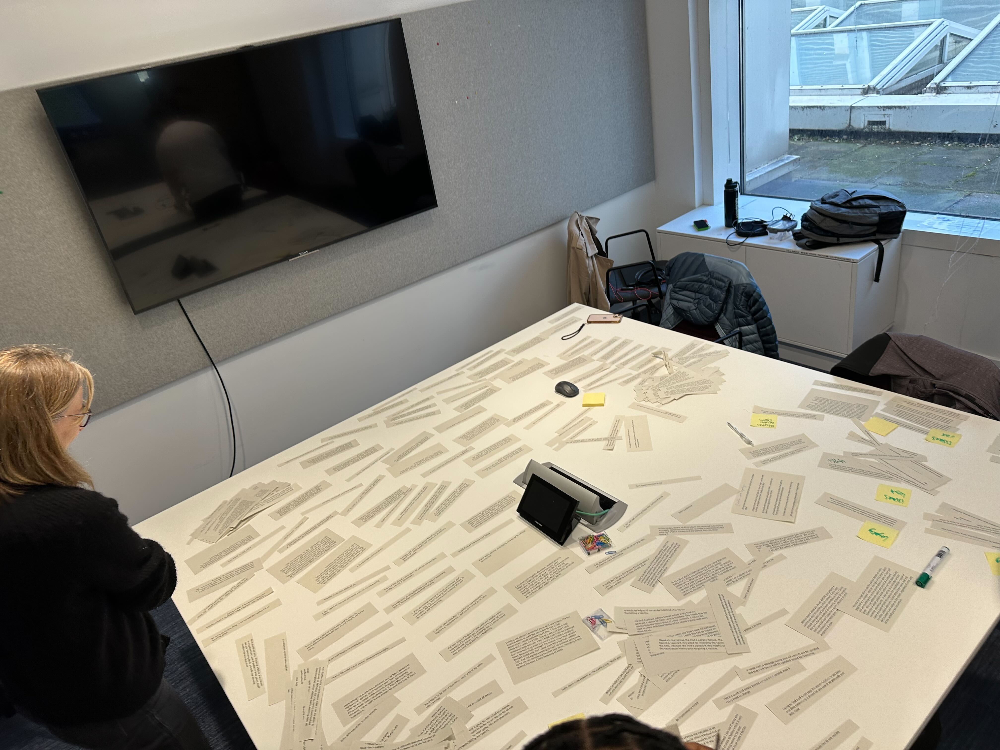

On 26 November 2024, we emailed all users of our service, around 16,500 people, asking them to take part in a short customer experience survey. This post is about what we asked and what our users told us. 

## Why a survey and why now

Record a vaccination (RAVS) has been used to record vaccinations since September 2024. Over the past year we’ve done several rounds of in-person and remote user research and usability testing. 

We’ve also had a permanent link to a feedback survey in the header of our service. This has provided useful insights but it’s not been widely used. In total, we’ve had just over 400 responses and they have not been evenly spread over time. 

At busy times, such as during October 2025, we’ve had up to 20 people leaving feedback per week. But at quieter times it might only be 1 or 2 people a week.

We wanted a snapshot of people’s experience of RAVS during a defined period of time and ideally based on a large number of responses. 

We also wanted to start tracking user satisfaction as one of our KPIs. Our plan is to run  regular surveys at intrevals of 3 or 4 months. 

## What we asked in the survey

We created the survey in Qualtrics. It included 12 questions. 

The first question was how often have you used RAVS over the last 2 months. If the response was they’d not used RAVS at all, the participant would exit the survey. 

Most of the questions were statements and we asked participants to what extent they agreed or disagreed with them.

We also asked users about their overall satisfaction with the survey and if they had any suggestions for improvements.

### How we contacted people to ask them to take part

We sent this short email using GOV.UK Notify, the platform we use for all emails we send users.

**Subject line: Help us improve NHS Record a vaccination (RAVS)**

Dear ((FirstName)) ((LastName)),

We’d love to hear about your experience using Record a vaccination (RAVS) so that we can improve our service.

Please take a minute to complete our short survey:
RAVS customer experience survey [link]

All your answers will be anonymous.

Many thanks,
NHS Record a vaccination

## What our users told us

When we closed the survey 2 weeks after sending the email, we had 1,275 responses. Most of these (around 1,000) came in the first 48 hours after we sent the email. 

Here’s a breakdown of the responses we got.

### Over the last 2 months how often have you used RAVS?

| Frequency                            | Percentage of users   |
| :----------------------------------- | --------------------: |
| A few times a week                   | 44%                   |
| Almost every day                     | 18%                   |
| Once or twice                        | 15%                   |
| Once a week                          | 13%                   |
| Once a fortnight                     | 5%                    |
| Not used RAVS                        | 5%                    |

### How satisfied are you with RAVS overall? 

| Satisfaction level                   | Percentage of users   |
| :----------------------------------- | --------------------: |
| Very satsified                       | 49%                   |
| Satisfied                            | 42%                   |
| Neither satisfied nor dissatisfied   | 6%                    |
| Dissatisfied                         | 3%                    |
| Very dissatisfied                    | 1%                    |

To what extent do you agree or disagree with the following statements?

### I find RAVS easy to use

| Agreement level                      | Percentage of users   |
| :----------------------------------- | --------------------: |
| Strongly agree                       | 54%                   |
| Agree                                | 39%                   |
| Neither agree nor disagree           | 4%                    |
| Disagree                             | 2%                    |
| Strongly disagree                    | 0%                    |

### I never need to go back to make changes

| Agreement level                      | Percentage of users   |
| :----------------------------------- | --------------------: |
| Strongly agree                       | 31%                   |
| Agree                                | 37%                   |
| Neither agree nor disagree           | 15%                   |
| Disagree                             | 16%                   |
| Strongly disagree                    | 1%                    |
 
### I’m able to complete tasks efficiently in RAVS

| Agreement level                      | Percentage of users   |
| :----------------------------------- | --------------------: |
| Strongly agree                       | 45%                   |
| Agree                                | 44%                   |
| Neither agree nor disagree           | 6%                    |
| Disagree                             | 4%                    |
| Strongly disagree                    | 1%                    |
  
### RAVS is reliable

| Agreement level                      | Percentage of users   |
| :----------------------------------- | --------------------: |
| Strongly agree                       | 41%                   |
| Agree                                | 46%                   |
| Neither agree nor disagree           | 10%                   |
| Disagree                             | 3%                    |
| Strongly disagree                    | 0%                    |
  
### RAVS integrates well with the way we work

| Agreement level                      | Percentage of users   |
| :----------------------------------- | --------------------: |
| Strongly agree                       | 39%                   |
| Agree                                | 46%                   |
| Neither agree nor disagree           | 10%                    |
| Disagree                             | 4%                    |
| Strongly disagree                    | 2%                    |
 
### I am a confident user of RAVS

| Agreement level                      | Percentage of users   |
| :----------------------------------- | --------------------: |
| Strongly agree                       | 50%                   |
| Agree                                | 43%                   |
| Neither agree nor disagree           | 7%                    |
| Disagree                             | 1%                    |
| Strongly disagree                    | 0%                    |
 
### When RAVS is updated, the changes are clearly communicated

| Agreement level                            | Percentage of users   |
| :----------------------------------------- | --------------------: |
| Strongly agree                             | 25%                   |
| Agree                                      | 31%                   |
| Neither agree nor disagree                 | 29%                   |
| Disagree and strongly disagree combined    | 5%                    |
| Not sure                                   | 10%                   |

 
### Does RAVS provide you with everything you need?

86% answered Yes
14% answered No

### Please tell us how RAVS could be improved.

We got 563 responses to this question which was fantastic in terms of the rich insights they provide but also somewhat overwhelming. We dedicated a December retro to doing an initial sorting exercise. This involved cutting up 92 pages of feedback into individual comments, grouping them into piles and identifying themes.   

## Reflections and what next

We were very happy to learn that 91% of users were either very satisfied or satisfied with RAVS overall. 

But at the same time the survey highlighted that satisfaction levels vary across different areas and there is lots of potential for improvement. For example, when asked if changes to the service were clearly communicated, only 56% agreed or strongly agreed. 

We still have lots of sorting to do of all the free text suggestions. And then we need to work out how to prioritise and address the feedback. 

Some suggestions are things we’ve already addressed or that are on our roadmap. But there are lots more suggestions for improvements big and small, that we’ll need to look into.

One thing we'll do differently next time is tell people how long the survey will be open for when we invite people to take part. 
