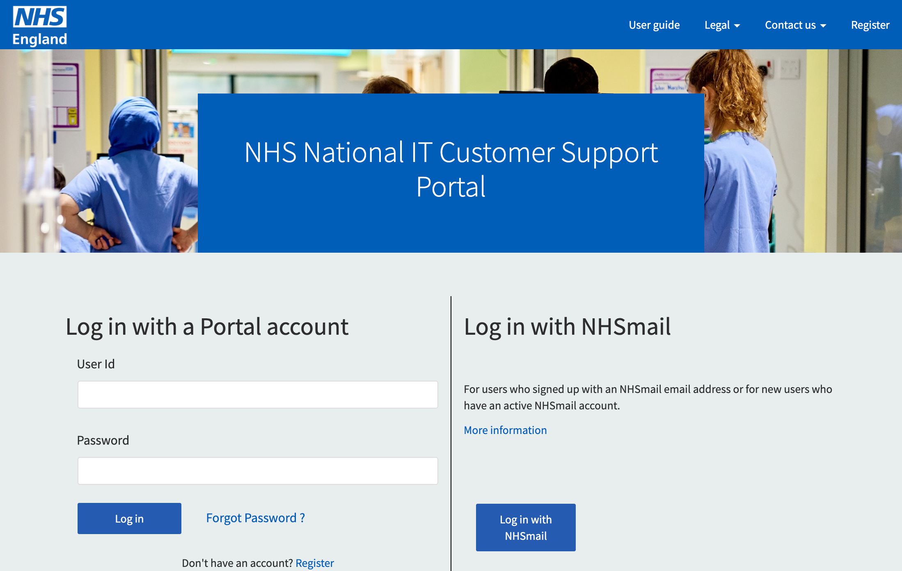
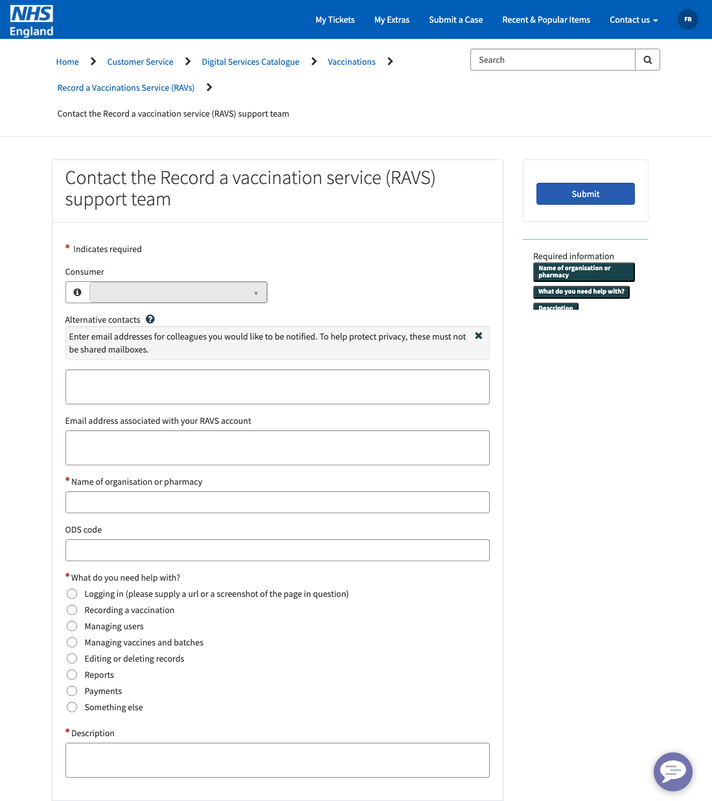
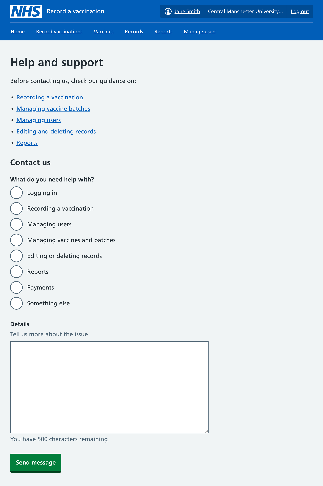
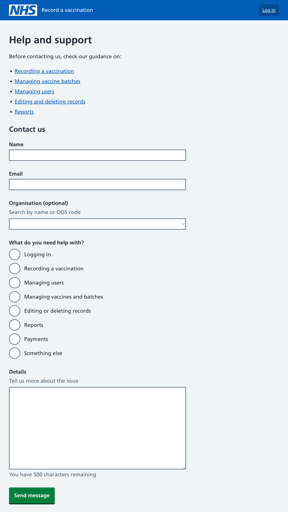

Since the service launched with [an initial pilot](/record-a-vaccination/2024/07/pilot-designs/) back in June 2024, users have been able to contact a support team via a phone number and email address.

We are now switching to using the NHS national IT customer support team. As part of this, we’ve been looking at how users will be able to contact us.

## The NHS National IT Customer Support Portal

The default way to contact the NHS national IT customer support team is via a form hosted on a customer support portal.

To access the form, users must first sign in. They can do so either by using their NHSmail account, or by registering for an account on the portal using a different work email address.

Once they are signed in, they can access a dedicated form for our service.

We are able to work with the national support team to decide on which questions to include, although a couple of the fields are fixed as they are standardised across all the forms.

We have initially chosen to keep the form as minimal as possible.

## Bringing the form into the service

There are some disadvantages to linking off to the form on a separate portal.

The biggest bit of friction is likely the requirement to log in, using a different account from the one used by RAVS itself. Whilst most of our users will have an NHSmail account, some staff in pharmacies may not, or may not use it regularly.

Forms on the portal also use a different design language from our service, for example with the submit button in a different location (top right), and using red asterisks for required fields.

For the support team, there is also the possibility that users submit requests using a different email address from the one they use in the RAVS service, which may cause confusion or additional work to resolve the case.

For these reasons, we have explored an alternative approach where we instead include a contact form within the RAVS service, and send the information to the support team via an API.

When users are logged in, we could reduce the number of questions asked, as we already know the user’s name, email address and organisation from their logged in account:

The ‘What do you need help with?’ question is there to both help the support team triage the contacts, and also to give us some data on what things people are contacting us about. We have selected categories based on what we know of previous support queries, but may change this in future as we learn more. A ‘Something else’ option is included for anything not covered by the other options.

At the top of the form, we have included some links to our guidance pages. Previous research has indicated that not all users know about this content. These links aim to help users find the answer to their question without having to contact us.

## Contacting us when logged out

We also want to give users a way to contact us when logged out.

This might be used when:

* there is an issue with their account preventing them from logging in
* they are not yet a user of the service but want to contact us about potentially using it at their organisation

To enable this, we’ve designed a version of the same form with additional questions for the person’s name, email address and organisation (which uses an autocomplete):

## Next steps

We plan to develop our support form in time for the start of the next flu vaccination campaign in September 2026.

In the meanwhile there will be a period where we link to the external form on the customer support portal instead.

We plan to do some research to evaluate how well the switch from the phone number and email address to the contact form works for our users.

