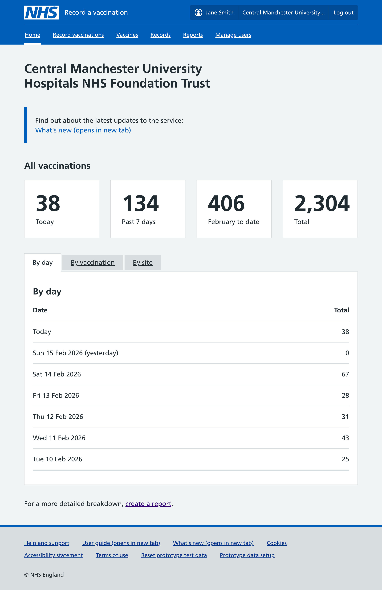
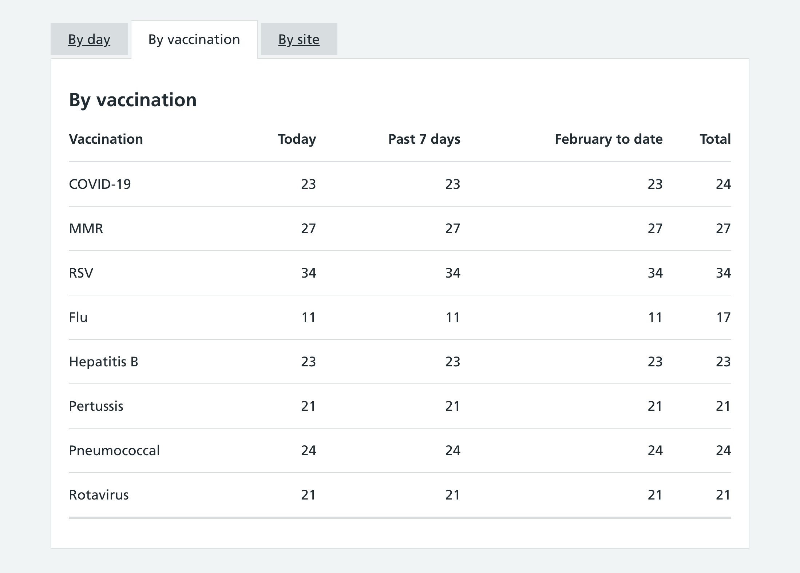
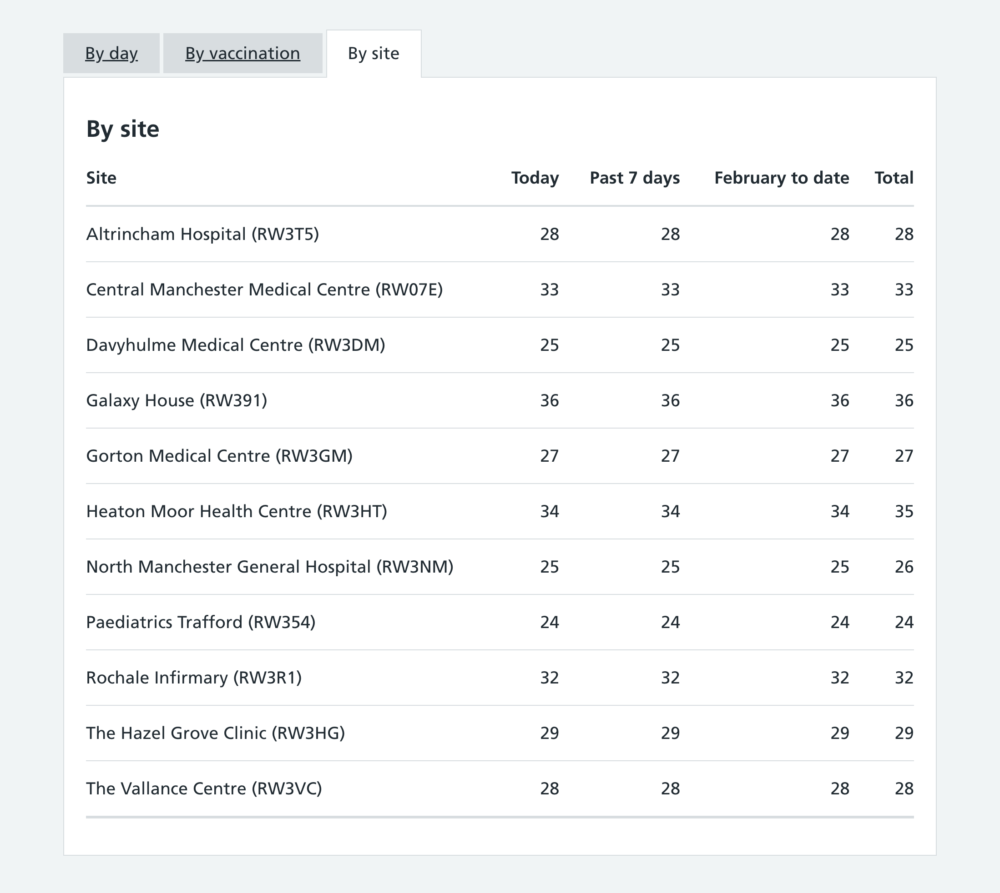

Around a year ago, we [introduced a new home page](/record-a-vaccination/2025/02/new-home-page/) that users see immediately after logging in to the service.

The home page has been well received, with users telling us that it is useful to be able to quickly see some key numbers on vaccinations recently given.

As the service has grown, with more vaccines now able to be recorded, we’ve update the design to be more flexible.

## Previous design

The page contained a table which showed a breakdown of the figures, with a column for each vaccine type administered by that organisation.

A table below showed the same columns, but with a row per site instead.

This design worked reasonably well with a maximum of 4 vaccine types shown, but with any more than that the table would become too squashed or would no longer fit on the page.

## Updated design

In the new design, we use the [tabs component](https://service-manual.nhs.uk/design-system/components/tabs) to show different breakdowns of the figures.

The default tab shows totals by day:

The second tab shows totals by vaccination type, with columns for today, past 7 days, calendar month to date, and a total across all time. This is only shown when the organisation has recorded at least 2 types of vaccination.

The third tab shows total by site, again with columns for today, past 7 days, calendar month to date, and a total across all time. This is only shown when the organisation has recorded vaccinations at multiple sites.

## Response

This change went live on 2 February 2026.

We have since had a few users contact us to complain about no longer being able to see a detailed day by day breakdown of totals per vaccine type. Their feedback suggests that being able to see the count for ‘yesterday’ by vaccine type is particularly useful, for checking on performance and stock levels.

We have also had some questions about whether the counts by day represent the date of vaccination or the date that the vaccination was recorded, which can be different if it was recorded retrospectively. Currently they are counted by date recorded, however this is not clear.

## Future considerations

We will consider adding in columns for ‘Yesterday’ for the tables by vaccination and by site.

We’ll also do further research to check whether or not the ‘Past 7 days’ and calendar month to date columns are definitely useful, or if these should be swapped for other time periods.

We’ll aim to remove the ambiguity over which date the tables are using, and may switch to counting by vaccination date instead of recording date.
