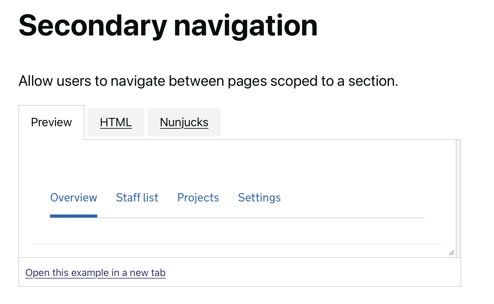
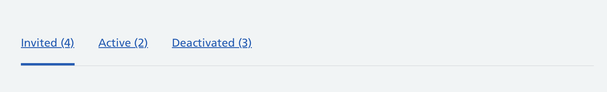
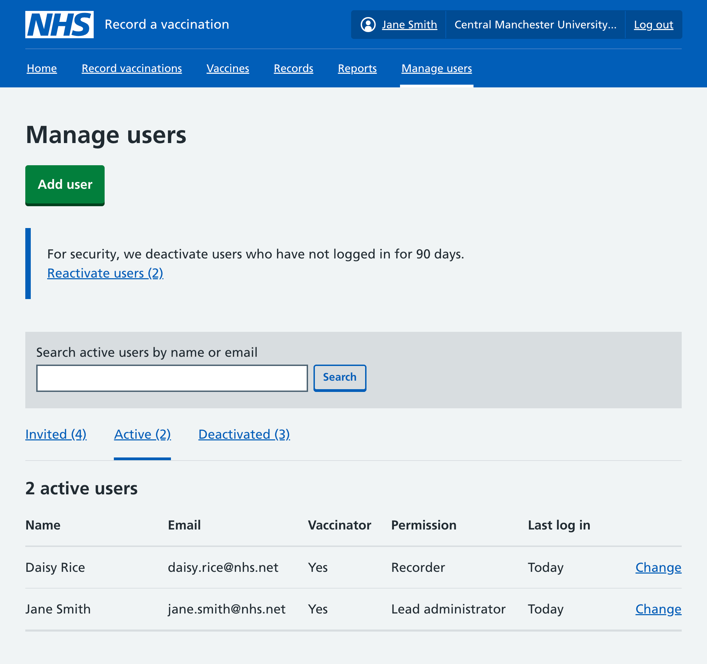
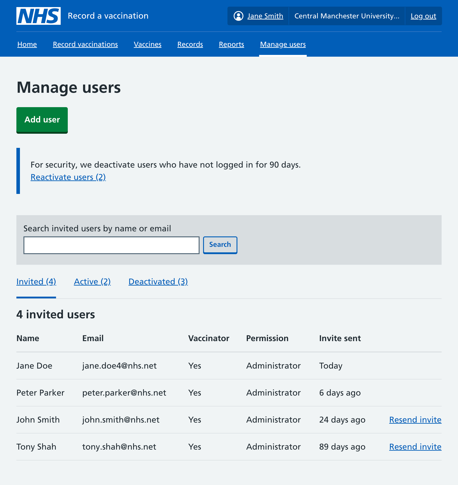
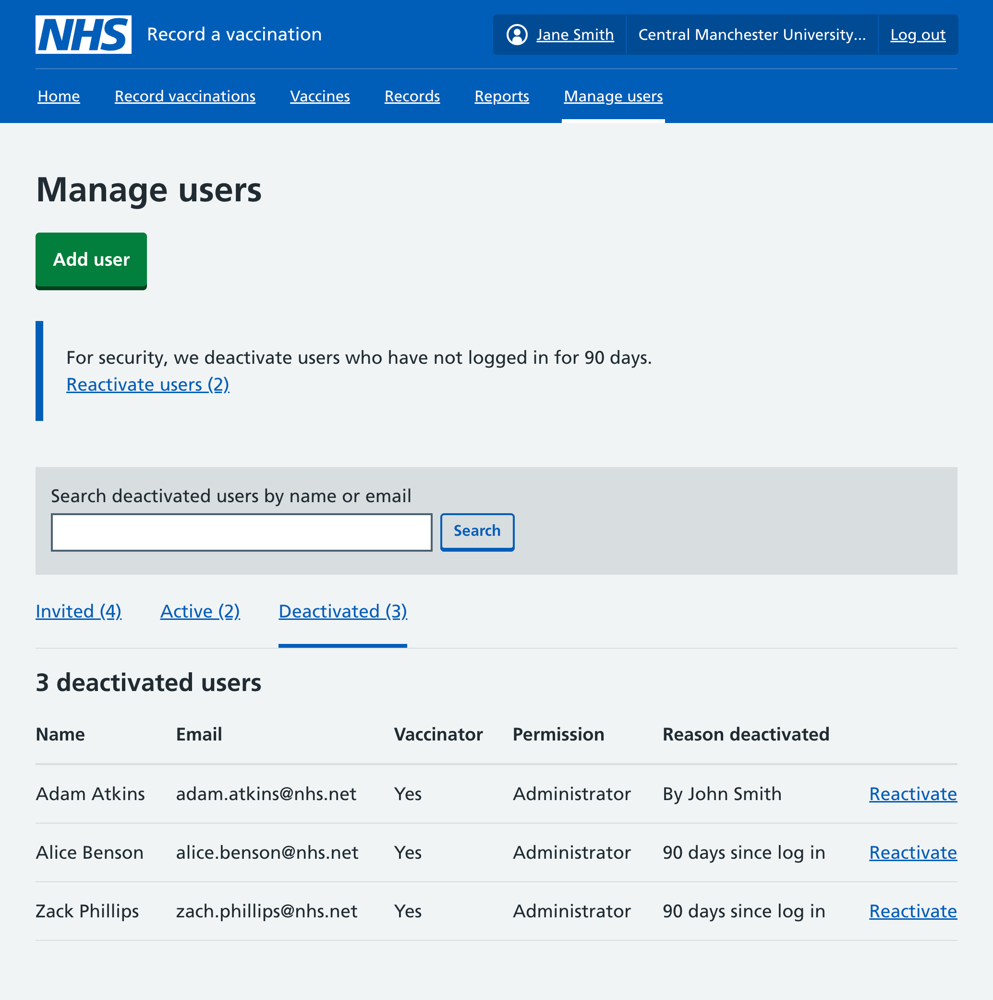

When visiting the Manage users section, lead administrators are able to all users within their organisation. Previously this was displayed as a single table ordered alphabetically by name, with a column to show the status of each user.

We have now updated the design of this section, introducing secondary navigation to split up the list of users by their status.

This change went live on 12 March 2026.

## How the secondary navigation works

There is not yet a secondary navigation component within the [NHS design system](https://service-manual.nhs.uk/design-system), so we have based the design on the [X-GOVUK secondary navigation prototype component](https://govuk-prototype-components.x-govuk.org/secondary-navigation/).

The secondary navigation displays horizontally on desktop, but switches to a vertical layout on mobile. It uses an unordered list (`<ul>`) within a navigation element (`<nav>`).

We have adapted it to use the NHS typeface and colours. The links are also underlined, following the convention from the NHS header.

Each item in our secondary navigation includes the number of users with that status in brackets, to give lead administrators a quick sense of how many there are.

The items in the navigation is only be included if there is at least 1 user with that status. If there are no invited or deactivated users, then the secondary navigation is not included at all.

## Active users

The default view now only lists active users.

There is a column which shows when each user last logged in, for example 'Today' or '13 days ago'. This is to help administrators see which users may soon be deactivated due to not logging in for 90 days.

## Invited users

This page lists users who have been invited to use RAVS for the organisation, either by a lead administrator or an NHS England region administrator, but who have not yet logged in.

There is a column showing how long ago the invite was sent. If the invite was sent more than 7 days ago, we included an action link to let the lead administrator resend the invitation email. This is to help if the invited user cannot find the email in their inbox.

## Deactivated users

This page lists any users who have been deactivated from the organisation in RAVS.

A column lists the reason that each user was deactivated. This could be due to not logging in for 90 days, or because they have been deactivated by a lead administrator. We included this information to help lead administrators understand why a user no longer has access, and avoid any confusion.

An action link is included for each user which allows the lead administrator to reactivate them.

## Future considerations

We have included a search field within the designs, mainly to help any organisations with very long lists of users.

This feature has been de-scoped for now, any may be developed at a future date. If we introduce this we will need to make that users understand that the the search is ‘scoped’ to the current view.

We will work with others in the NHS to explore how secondary navigation could become a component in the NHS design system.
