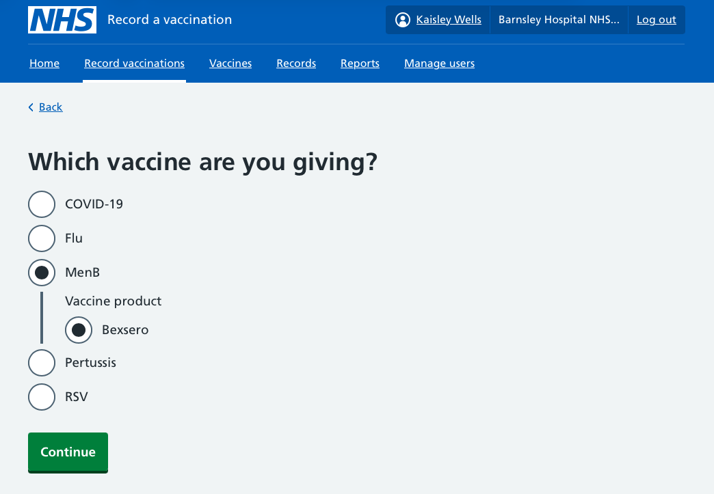
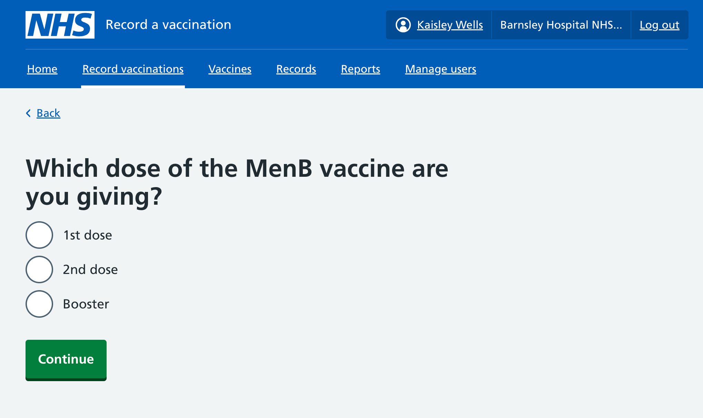

In March 2026 there was an [outbreak of meningitis in Kent](https://ukhsa.blog.gov.uk/2026/03/18/meningitis-b-outbreak-what-you-need-to-know/), in which 2 people sadly died.

In response, UKHSA and the NHS began a [targeted vaccination campaign](https://ukhsa.blog.gov.uk/2026/03/20/who-is-eligible-for-the-menb-vaccine-and-do-i-need-it-myself/), offering the MenB vaccine to students at the University of Kent and some other groups.

The MenB vaccine is given as 2 doses, 4 or more weeks apart.

We were asked by the local team to add the MenB vaccine to the Record a vaccination service (RAVS) so that these vaccinations could be recorded.

This required a small number of changes to the service.

## Vaccine and product

We added the MenB vaccine type, and the Bexsero vaccine product to RAVS.

## Dose sequence

As the MenB vaccine is given as 2 doses, we added a new question to ask which dose was being recorded:

Although we do not expect the booster option to be used by the local team in Kent, we included it as this dose is given to children when they turn 1, and this may be a use we support in future.

## Eligibility

We did not include an eligibility question.

This is because the MenB vaccines being given in Kent are outside of the regular routine vaccination schedule.

The eligibility question for vaccinations is also not included in the data sent to GP records and other systems, and we have wider questions about the usage of this information, whether it needs to be recorded, and if so at what level of detail.

## Other questions

The other questions remained unchanged and are:

- date
- site
- vaccinator
- batch number
- consent
- injection site

## SNOMED codes

When we record vaccinations and send the record to GPs via the [immunisation API](https://digital.nhs.uk/developer/api-catalogue/immunisation-fhir-api), we use [SNOMED CT](https://digital.nhs.uk/services/terminology-and-classifications/snomed-ct) codes.

We include these codes for the procedure:

- First dose: [`720539004`](https://termbrowser.nhs.uk/?perspective=full&conceptId1=720539004)
- Second dose: [`720540002`](https://termbrowser.nhs.uk/?perspective=full&conceptId1=720540002)
- Booster dose: [`720544006`](https://termbrowser.nhs.uk/?perspective=full&conceptId1=720544006)

For the product, [`23584211000001109`](https://termbrowser.nhs.uk/?perspective=full&conceptId1=23584211000001109) is used for Bexsero.

## Response

These changes were made to the service on 2 April 2026.

As of 12 April 2026, over 8,000 MenB vaccinations have been recorded in the service by the team in Kent. These were originally recorded on paper (before 2 April) and have been transcribed into the service.  The [same vaccination for another patient](/record-a-vaccination/2025/09/making-it-easier-to-record-next-vaccination/) feature has made this easier.

As the patients get their second dose, these will be recorded directly into the service avoiding the need for a paper record.
