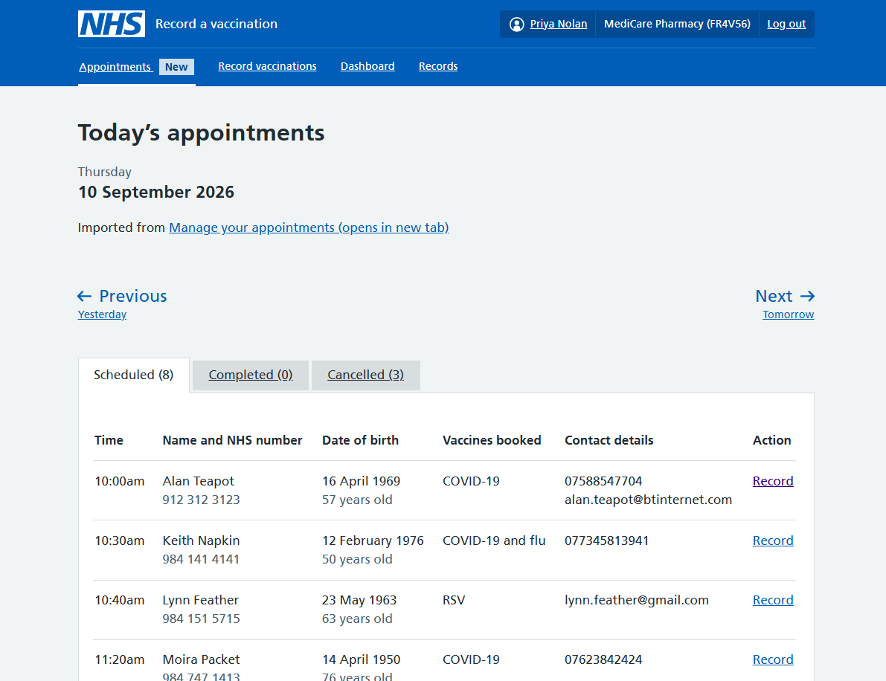

As a first step towards integrating Record a vaccination (RAVS) and Manage your appointments (MYA), we've decided to add an appointments section to RAVS. 

## Background  

RAVS and MYA are separate staff-facing NHS services that are often used by the same people. 

Typically, the users who access both services are healthcare workers based in pharmacies. They manage their NHS vaccination bookings in MYA and then record the NHS vaccinations they give in RAVS. 

Currently you have to log in to each service separately to view appointments and record vaccinations.  
 
We often hear from users in pharmacies that a daily pain point is having to log in to so many separate systems and remember passwords for each one. Some pharmacists have asked us explicitly why MYA and RAVS are not 1 service. The short explanation is that they were developed separately at different times.  

## What we did 
  
When our teams discussed how we could bring the 2 services closer together, a full integration – where you would log in to 1 service to do to all the things you can currently do in MYA and RAVS – was not deemed feasible in the timeframe we were considering. 

So our focus was on a solution that would offer some benefits to users of both services even if it fell short of a full integration.  

We decided to explore pulling a view of the day’s appointments from MYA into RAVS via an API. And then allowing users to start recording from this appointments view, skipping the usual first step of the recording journey in RAVS which involves searching for the patient.  

Our design also included separate tabs to show completed and cancelled appointments. 

As well as showing the day's appointments, we decided to show future and previous appointments up to 7 days in the future and 7 days in the past.  
 
Users would still need to access MYA to keep their appointment availability up to date. 
 
We thought the main benefits for users would be: 

- they would no longer need to log into MYA on a daily basis, as the bookings for that day would be available in RAVS  

- they would skip the step of searching for the patient in the recording journey in RAVS because they would already see the patient’s details in the new appointments section
  
- at the end of the day, they would easily see a list of people who had not attended their appointment 

- they may no longer need to print a list of the day's appointments – we heard from the MYA team that users often do this, for example to have NHS numbers at hand when they record a vaccination, or to check patients in at the front desk 
 
## What we learned from user research 

These were the key findings from user research with 11 participants who used both RAVS and MYA (10 in pharmacies and 1 in a trust).  
  
- Many users expressed that this was long awaited addition to RAVS. 

- Everyone was pleased to be able to start recording a vaccination from the appointments page in RAVS – participants said that not having to input an NHS number to find the patient would increase speed and accuracy. 

- The appointments page showed the right amount of information about each booking, including NHS number, date of birth, age and contact details.  

- In terms of seeing appointments in the future and the past, there was a broad consensus that looking forward 7 days would be enough – this was considered  helpful for planning vaccination clinics and managing stock. Looking back was less important – 1 to 7 days was sufficient.

- Easily seeing who had not attended was considered useful as the user could then follow up with that patient and see if they still needed an appointment

- Users would still want to print the day’s appointments with the only difference that they would print from RAVS instead of from MYA. We heard that this is something they would still need to do for operational reasons, for example so that front desk staff, who may not have access to RAVS or MYA, have a list of bookings to check patients in.  

## What we changed  

We made some minor changes to our designs based on user feedback. For example, for past appointments, we amended the designs to only go as far back as yesterday. 

Some users suggested some further improvements which we have not explored but have added to our backlog. For example, some participants told us they would value check-in or partial save features that could enable front desk staff to input some information in advance of the actual vaccination.  
 
Some users also wanted a single system with one log in, in other words a full integration of MYA and RAVS. 

## What’s next 
  
The MYA team are working on an API so that appointment information can be sent to RAVS. Once that is available, we will hand over designs to the RAVS dev team. And we will update this post once the feature is live. 
