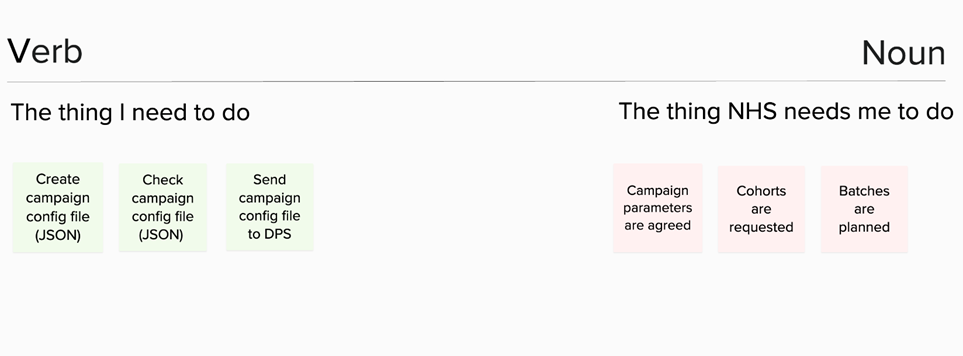
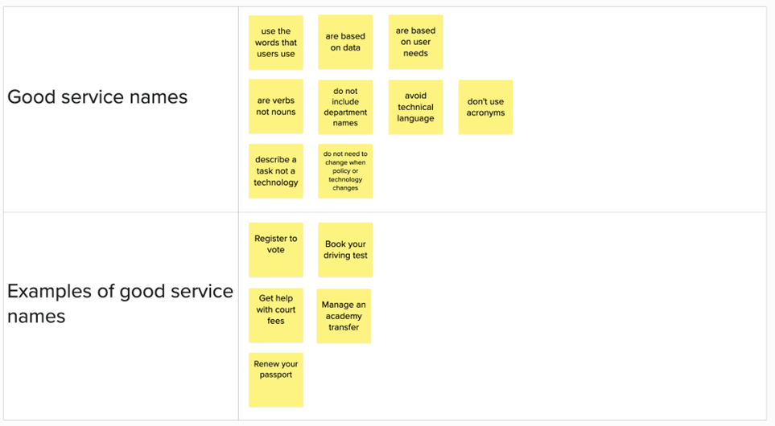
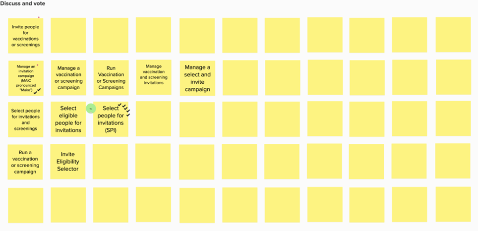

## Our service

'Select People for Invitation' is an internal service. This means that only NHS staff will use this service and not the public.

Previously, the service was described by the team as ‘Invitation Processor'. The name didn’t clearly explain what the service actually does.

So we needed a new, self-explanatory name that would be explain what this service does, both for members of the Select and Invite team and wider NHSE and NHS staff using the service.

## Using the service manual

The ['naming your service' section of the GDS Service Manual](https://www.gov.uk/service-manual/design/naming-your-service) says we should only ever use descriptive names.

They must describe what the thing is and what it's for. [We use verbs instead of nouns](https://designnotes.blog.gov.uk/2015/06/22/good-services-are-verbs-2/) and names that don't need to change when policy or technology changes, as this would be confusing for users.

## Namestorm

The next step was to think of possible names. We shared a Mural board with the members of the team, which documented the information we had collated and asked them to add as many names as possible, asynchronously.

Once we had lots of name suggestions we could begin the elimination process. We eliminated anything that:

- didn't start with a verb
- wasn't descriptive
- wasn't self-explanatory

We got down to 11 stickies and did a vote to see which one we liked best:

We made sure that the service name we selected made sense when explaining the service to somebody:

> Are you aware of the 'Select People for Invitation' service? It's a service run by the Select and Invite team, which allows users to send invitations to members of the public.

## Collecting user feedback

We are currently holding research sessions to collect feedback for the service prototype from users. As part of this, we will collect feedback from users about the new name for the service.
