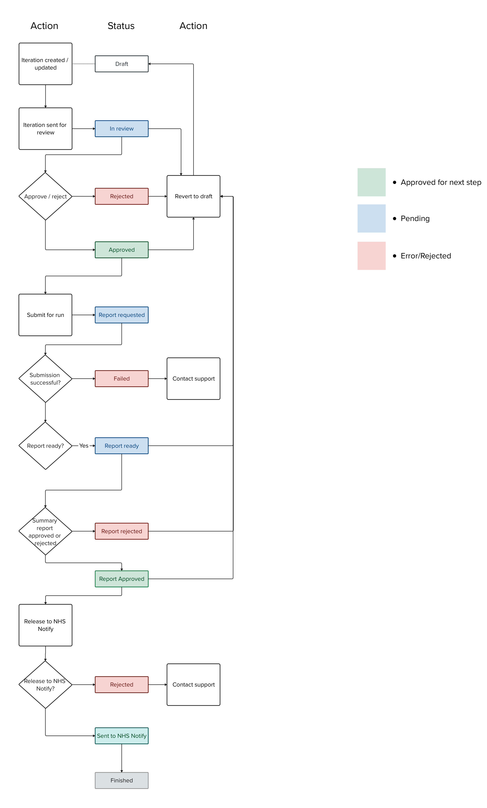
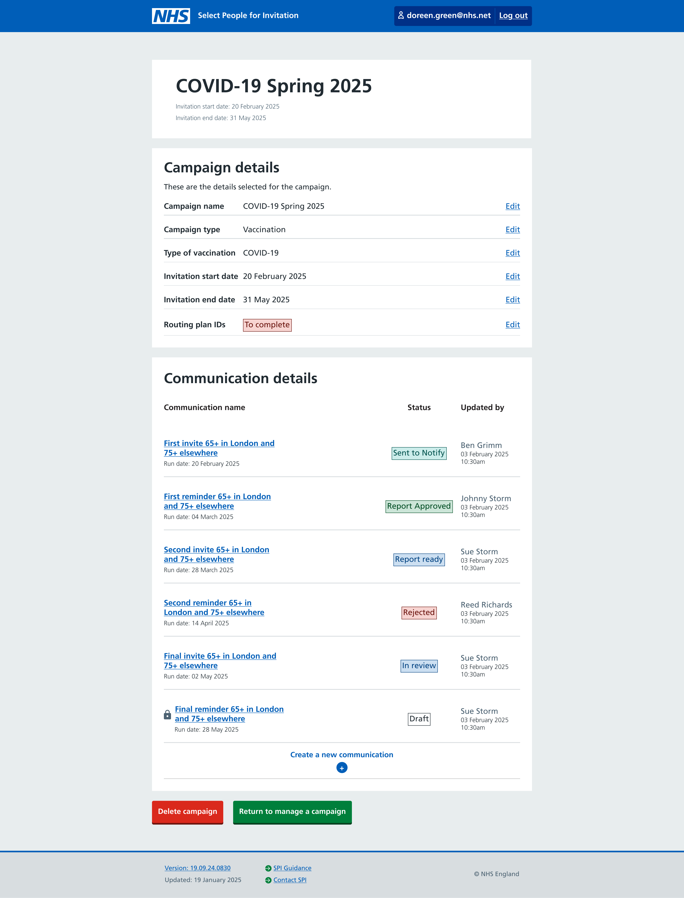

Following on from the workshop and design work we did to define the overall [workflows and approvals process](/select-people-for-invitation/workflows/), we did some work to document the different iteration statuses that the workflow requires.

## Background research

User research has told us:

- the 2-step approval process is important, so we need to be able to communicate at what stage an iteration is in that process
- "iteration" (as a noun) isn't a term that naturally fits the users' mental model. We already have this finding in our backlog of things to look at and plan to test alternative terms with a wider group of users as a separate piece of work

## Design

We started by drawing a flow chart style diagram to map out the workflow and associated iteration statuses.

This allowed us to form the basis for the logic required in the back end and create design tickets to produce some prototype screens.

Below is the campaign summary screen showing a number of iterations in different states.

**Note** that "iterations" are called "Communications" and titled "Communication details" in this design as part of our work to look at the terminology.

## Feedback

Initial feedback from users was positive and they felt the statuses were easily understood and clearly showed at what stage in the process each iteration is.
