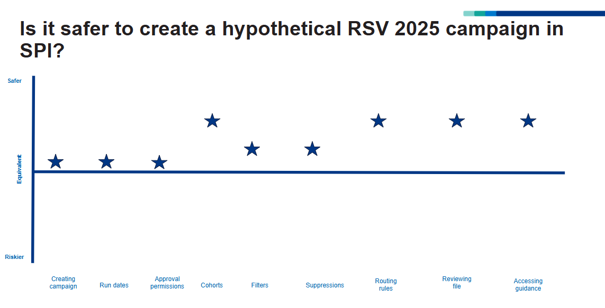

The outcome of the service is to send invitations to members of the public. For the national vaccination campaigns that we work on this can be millions of invitations. It is extremely important that we invite the right people with the right invitation. It would be costly (reputationally and financially), if we were to send invites to the wrong people. Therefore increasing safety is an important goal for us. By safety we mean mitigating the risk of making a mistake in the configuration and accidentally sending erroneous invitations. 

## Measuring safety

We work with a clinical safety team who perform regular reviews to ensure the service doesn't contain any undue risk. But we wanted to find a way to quantify the safety of the service. 

Working with users, we designed a task for them to create a configuration that would invite people for a hypothetical RSV vaccination. After they had performed the task using the SPI user interface we asked them to rate how safe they perceieved the process to be in comparison to the old process (before we had introduced the user interface users had to manually create JSON files to set the configuration).

The chart below shows how users felt about the safety of the process using the SPI user interface in comparison to the previous process (represented by the equivalent line). Although this did not give us an absolute scale, it showed us that users felt the process was safer overall and we could see which areas had improved most.

## Iterating and measuring again

A few weeks later, after doing work on the [Rule library](/select-people-for-invitation/2025/03/rule-library/), we did a similar exercise. This time with a more complicated hypothetical Covid invitation configuration. The chart below shows how users safety ratings have improved again. 

This is an approach we can continue to use, alongside the regular reviews with the clinical safety team to ensure that we don't introduce any features which reduce safety and that we are focussed on continuing to eliminate risk where possible.

