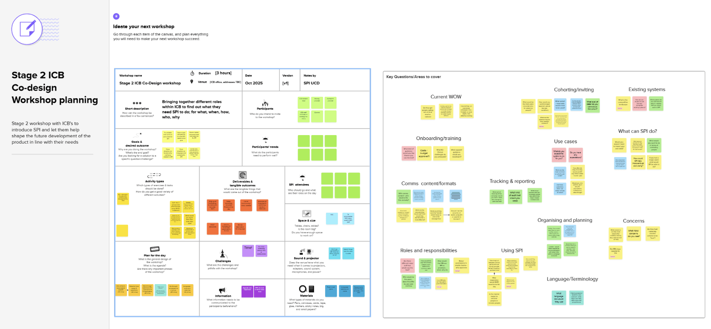

Currently the Select People for Invitation (SPI) service is used to send invitations to book vaccination appointments for:

- COVID-19
- Flu
- MMR
- RSV

There are 3 main user groups involved in SPI:

1. The **vaccination programmes** within NHSE who commission the SPI service to send the invitations
2. The **SPI operational team** who operate the service to achieve the outcomes agreed with the vaccination programmes
3. The members of the **public** who receive the invitations

## How this might change

The [NHS vaccination strategy](https://www.england.nhs.uk/long-read/nhs-vaccination-strategy/) and the [NHS 10 year plan](https://www.gov.uk/government/publications/10-year-health-plan-for-england-fit-for-the-future) both talk about giving more autonomy at a local level. This has previously been called "delegation" and was framed as delegation of commissioning vaccine services from NHSE to integrated care boards (ICBs). The language is evolving, and this theme is now known as "future accountabilities".

Whilst all of the detail isn't yet known, the theme of greater local autonomy is clear. To that end we have engaged with ICBs to learn about how they see the future landscape and what role SPI might play for them.

This is leading to the possibility of new user groups either commissioning or operating SPI, possibly ICBs or maybe operational teams within an ICB such as a neighbourhood health team. 

## What have we learned so far

We have done 9 interviews with ICBs, and the findings have been very positive. Some examples of things we learned:

- ICBs are keen to provide a choice of vaccination providers to the public
- Currently they aren't able to send targeted invitations, they rely on generic communications
- The ability to send invitations isn't equal across all vaccination providers 
- They see a benefit in being able to send invitations to very specifically targeted geographical areas (e.g. around the location of a mobile unit)
- They would like to be able to respond quickly in the event of an outbreak

Some quotes:

> My eyes lit up when you contacted me about SPI

> Direct ICB‑level communications would reduce friction, help GP budgets, and speed up outreach

> Million percent we could use that if we could send out and invite people

Contact the SPI team if you would like access to the full research findings report.

## What are we doing next

The next step is to work more closely with ICBs and the local health systems. 2 ICBs have expressed an interest in being early adopters, and we are in the process of planning a series of workshops. 

Throughout those workshops we hope to learn more about how they see the vaccination landscape evolving, about their user needs and to develop SPI alongside them. 

