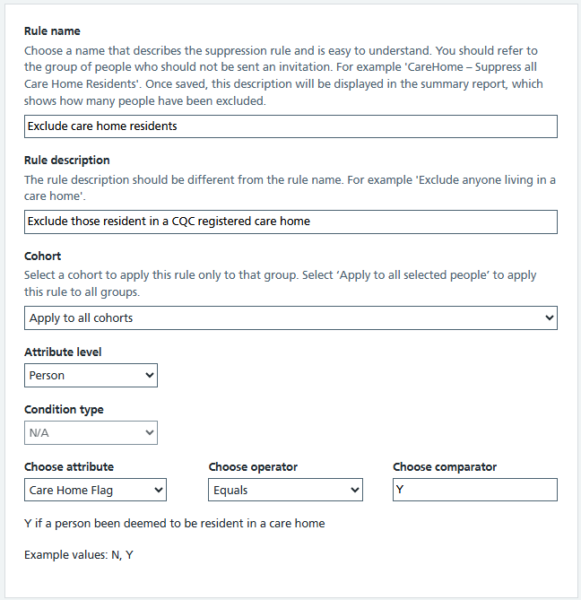
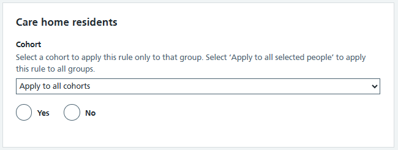

Our initial way to add rules was through a rule builder form, which required a high degree of technical understanding. Our first version of the [rule library](/select-people-for-invitation/2025/03/rule-library/) was a way of pre-populating that form with certain values to make the process easier for users. 

Our research showed this was a big step forward in making it easier for users to add commonly used rules, however there was still a lot of scope for improvement. We anticipated this might be the case as the first rule library implementation was very much a minimum viable product approach - we wanted to add value quickly and learn more about the way users interact with the system. 

## The problems we wanted to fix

- Having some parts of the form pre-populated was useful, but where values needed to be changed it was still fiddly to use
- There was some risk of not updating the right parts
- Users still didn't feel that the form was as simple or intuitive as it could be

## Our approach

- We reviewed the list of rules that were in the library and categorised them
- They fell broadly into 4 types of rule:
  - **Text:** Rules that require a parameter configuring as text e.g. exclude people under a certain age (age is the text parameter)
  - **Text and date:** Rules that require a text parameter and a date parameter, e.g. exclude people under a certain age on a particular date
  - **Pick list:** Rules that require one or more parameters to be selected from a list of options, e.g. exclude people who are not registered to a GP within certain Integrated Care Boards
  - **Radios** Rules that require a single selection from a group of options, e.g. exclude people living in care homes (yes / no)

We designed a template for each type of rule, which means the user interface is tailored to the rule type. Therefore the interaction is much simpler, quicker and safer for users.

This image shows the old screen for excluding care home residents:

This image shows the new screen, which as can be seen is very much simpler to use and easier to understand:

A note on the technical implementation: every rule which follows the same template uses the same underlying code, but configured through customised parameters. This means we ensure a consistent approach and we don't have to maintain many versions of a radio button rule page for each individual rule which uses that pattern.

## Feedback

Initial user feedback has been very positive. Users find these new tailored rule pages much simpler and easier to use than the old way of all rules using the same generic form.

## Next steps

The development work to roll this out is ongoing and we're continuing to review the types of rules that are being used in live campaigns. The library caters for the commonly used rules, but for more unusual ones the old rule builder form is still required. We've begun to refer to this as the "custom rule builder" and made the rule library the default way to add rules. Access to the "custom rule builder" is restricted to a certain user role, so if we onboard new users to SPI we can prevent them adding any type of rule which isn't in the library - which makes the service a bit safer for new users.

We have also defined a process for users to request new rules be added to the library.

