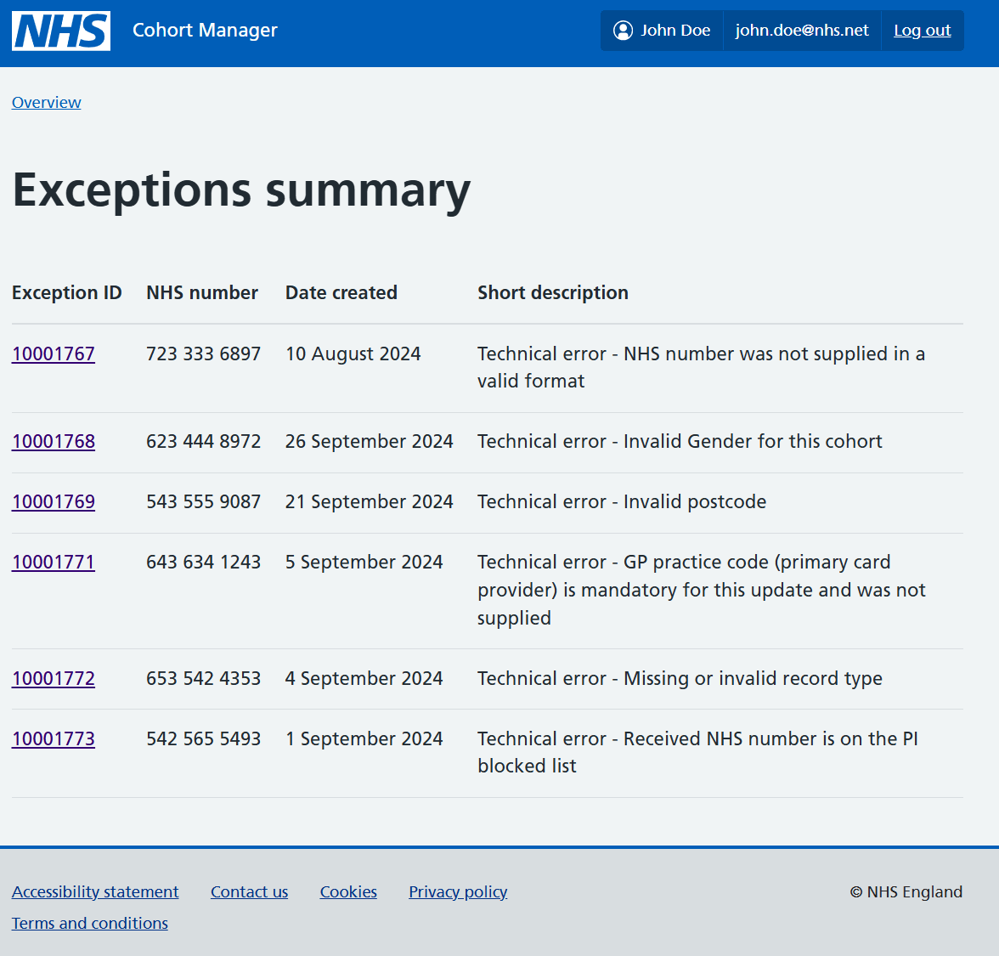

Cohort manager is being developed to help identify, receive and correct the demographic details for eligible participants of a screening service, so they are correctly selected for invitation. It's initially being built for use with the breast screening programme, with the intent that it will be available for use by any screening programme in the future.

Please note that this post provides the early design of our user interface. We'll be sharing updated versions soon and exploring how it has been developed to align with changes in our user group and the tasks they will complete.

## Improving the quality of screening data

To begin, imagine a person whose NHS record has been selected as being eligible for routine breast screening.

If their record contains even small errors or missing information, a data exception will be generated, meaning their screening invitation could be delayed while staff work hard to manually investigate and fix the problem.

To support this process and ensure that errors are picked up early and quickly resolved, cohort manager will apply a series of validation rules to each record entering the screening pathway.

It automatically identifies invalid or missing information (data exceptions) and can resolve many data issues, such as transformations, without staff intervention.

For cases that need manual intervention by staff, the system provides an interface that visualises the data exception and enables users to quickly direct it to the appropriate team for resolution.

## Our first design of the user interface

Our first prototype was based on our understanding of the work of participant index (PI) bureau colleagues. This is the team that manages data quality for routine breast screening cohorts in existing live systems.

Although the specific staff group using the interface has changed since this first design, its purpose was the same: to enable users to view any data exceptions that require manual intervention.

The long-term ambition is for cohort manager to raise all exceptions with the appropriate teams automatically. As the user interface is only intended to be an interim solution, decisions made around meeting each user need have been balanced against the time and resource it would take to build functionality.

Throughout this section we'll explore each screen of our initial prototype.

### Overview screen

This is the first screen that a user sees when they log into cohort manager. It uses the [card component](https://service-manual.nhs.uk/design-system/components/card) to provide a simple overview of data exceptions that require manual intervention.

Our hope was that this component would provide structure for the landing page whilst also serving as a dashboard. Each card is configured to display the number of outstanding exceptions for a particular category and provides users with a snapshot of tasks to help prioritise their workload. The user can click each one to navigate to more detail.

### Summary screen

Depending on which card the user clicks on the previous screen, they will be taken to a summary screen that provides a quick view of all open exceptions for that category.

The intention is that by presenting the information in a [basic table](https://service-manual.nhs.uk/design-system/components/table), it's easier for users to compare and scan the data when prioritising their tasks.

Other key design components included on the summary page are:

#### Snapshots of key information for each exception

From our research with users, we knew that information they looked for to help prioritise and carry out their tasks effectively were:

- the participant's NHS number
- the date the exception was created
- a short description of the problem

#### Unique identifier for each exception

Each exception has a unique ID. We used this as the point of navigation for the user to find more detail about an exception.

### Participant details screen

Please note: the data shown in the image below is for demonstration purposes and is not a real person.

This is our final screen, where we provide more detail about each data exception.

In our initial design, this information intended to support the participant index (PI) bureau user to understand the problem with the record, whilst providing enough data about the participant to support any investigation needed to correct it.

The level of detail included was based on our research with this user group. We needed to find the right balance between:

- ensuring the user had enough detail to carry out their task
- avoiding overloading them with information
- preventing information governance issues that may arise from revealing more personal data than is needed for a task

To keep the layout simple, we used a summary list to pair related information and used [tabs](https://service-manual.nhs.uk/design-system/components/tabs) to separate the participant data from the details of the exception that has occurred. Our intention was to structure the information in a way that places the least strain possible on the user.

## Next steps

Our prototype is constantly improving as we test it with users, and we will highlight other useful information about the development of the interface in future posts.
