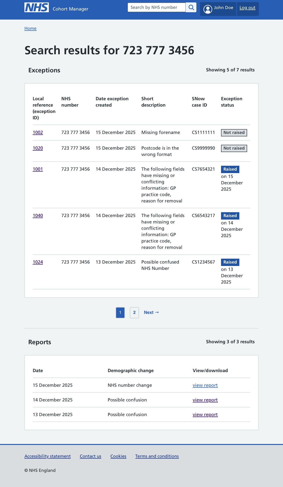
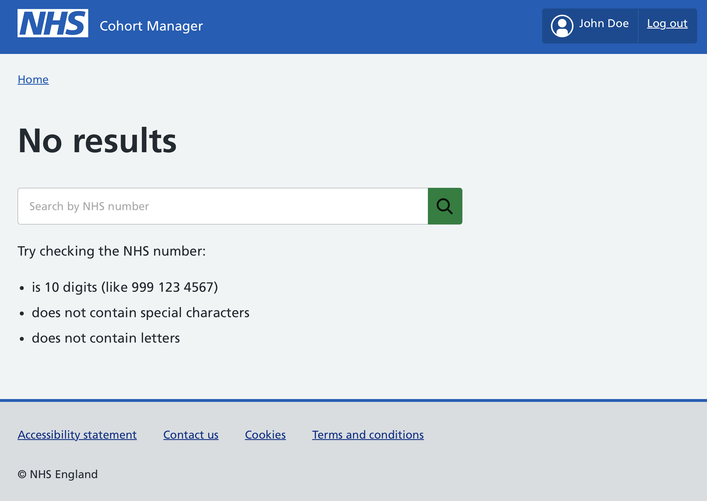

## Introduction

Cohort Manager is a product designed to improve data quality in screening programmes by identifying, correcting, and managing demographic details, so the right people are selected for invitation. When records enter the screening pathway, ‘validation rules’ detect issues such as missing or incorrectly formatted information. These are flagged as data exceptions: some are resolved automatically, while others require manual intervention through the user interface (UI), where they can be “raised” with the right teams for resolution.

We recently updated Cohort Manager’s UI to include a search feature so that users can quickly find all data exceptions and reports linked to a particular NHS number.

This addition builds on the foundations introduced in [our earlier post](/select/), which explained how the UI surfaces exceptions in participant data for resolution. The search feature was requested by a new user group with a slightly different need, and this post will explore how it was designed to meet that requirement.

### Cohort Manager user groups

Cohort Manager now serves three main user groups:
- **National Service Desk (NSD)**: Pick up data exceptions and raise them with the National Back Office (NBO), Cohorting as a Service (CaaS), and Breast Screening (BS) Select teams to be resolved.
- **BS Select Second Line Support Team**: Investigate complex participant data issues, such as possible confused or duplicate participant records. They require full historical visibility of reports and exceptions to track changes and resolve cases.
- **Service Management Team (SMT)**: Handle customer queries from Breast Screening Offices (BSOs) and support incident investigation and reporting.

## Why the search is needed (the problem)

The initial request for the search feature came from the Service Management Team (SMT). SMT users often need to resolve complex issues linked to a participant's record. This involves looking into the detailed history of issues to spot recurring activity and work out exactly what the problem is. 

Cohort Manager's user interface wasn't designed with this use case in mind. It only displays current data exceptions and can't sort exceptions by NHS number. This forces SMT users to manually navigate through multiple records, slowing down investigations, increasing the risk of duplication, and making it harder to align information across systems like ServiceNow. 

## The solution

We introduced a search bar in the Cohort Manager UI header that is accessible from any screen. The search feature was designed to meet these needs through simplicity and inclusivity. This global approach supports all three user groups, whilst ensuring that the feature is scalable and maintainable as the system develops. 

")

## Search by NHS number only

SMT users confirmed they would need to search by NHS number alone, so we limited the search criteria to this. As a unique identifier for a participant, this helps limit results and enables accurate searches with direct matches.

## Displaying historic information 

Crucially for SMT users, search results include historic exceptions and reports, not just current activity. This gives users the full history they need to investigate issues effectively. 

## How results are presented

Search results appear in a table showing the most recent items first for faster triage. The table includes key details to aid investigation: demographics, exception details such as **local reference, exception status** and **brief description**, **ServiceNow case IDs**, and **report types**. Users can click on individual results to view full details of exceptions or reports.

## Search error scenarios

When using the search feature, we considered the following common error cases:
- **empty input**: the search box is left blank
- **invalid format**: the NHS number entered does not match the required format

For all these scenarios, the system shows the ‘No results’ page :

## Challenges building the ‘no results’ page

This page was built without a ready‑made NHS design component. To replicate the look and feel, the HTML and CSS code had to be copied directly from the Chrome Developer Tool.

This highlights a gap: NHS should provide a dedicated design component for search and related pages. Having a reusable component would make development faster, ensure consistency across services, and reduce reliance on manual workarounds.

## How it tested

Prototype testing confirmed that the search met user expectations in terms of:  
- **the ability to view full details of each result**
Testing confirmed that users could click into search results and see the complete information behind each exception or report. This was important because investigations often require more than just a summary — users need access to the full demographic details, exception history, and linked ServiceNow case IDs to understand the context and resolve issues accurately.
- **clarity of information presented**
The prototype was checked to ensure that the search results table displayed information in a clear, structured way. Key fields such as NHS number, demographics, exception status, and report type were easy to read and logically organised. This clarity reduced confusion, helped users quickly identify the right record, and avoided mistakes during investigations.
- **alignment with real-world workflows**
The search feature was tested against actual scenarios faced by Service Management Team (SMT) and other user groups. For example, SMT users often need to trace the history of a participant’s record across multiple exceptions and reports. Testing showed that the search results supported this workflow by presenting historic data in newest‑to‑oldest order, making triage faster and investigations more consistent with how teams work in practice.

## Our future expectation

We hope the search feature will continue to make investigations faster and easier, giving users greater confidence when resolving participant data issues and simplifying workflows across ServiceNow and Cohort Manager.
