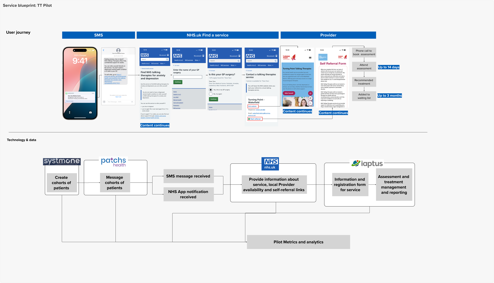

The talking therapies team in Personalised Prevention Services are working alongside the NHSE Talking Therapies and Behavioural Science teams to improve the uptake of NHS Talking Therapies by underserved groups (people who would benefit from the service but are not accessing it at the level that would be expected). This work ties to the 2025 Autumn Statement, where additional funding is being provided to increase the capacity of NHS Talking Therapies services.

Previously a discovery identified some of the barriers faced by people in underserved groups. We are now testing responses to those barriers. Our initial focus is a service to deliver messaging campaigns at scale with the ability to target these underserved groups.

## The problem

People who experience common mental health problems are not accessing the NHS treatments which could help them to get better. This means that their well‑being, their ability to work and flourish in everyday life, is not as good as it could be.

The discovery also showed that there is a lack of awareness around the ability to self‑refer and that people hold back because of concerns about:
- privacy
- availability of appointments
- taking up space from someone who needs it more than them

While local providers have run messaging campaigns using local insight and tooling, there is a gap for a more efficient, cheaper and less resource intensive national response. Laying the foundations for creating a simpler digital journey into NHS Talking Therapies.

## The opportunity

From a user perspective, there is an opportunity for people who are experiencing common mental health problems to find out about NHS Talking Therapies, recognise that it could help them and understand that they can refer themselves. Essentially taking a preventative approach rather than waiting for people to reach crisis.

From an Integrated Care Board (ICB) and NHS Talking Therapies provider perspective, there is an opportunity for better tools to manage the flow of referrals into local services to match capacity while also reducing GP appointment time.

There is an additional ambition that this will also help people stay in and return to work.

## Starting small to test and learn

Originally for this phase of work we intended to create a minimum viable product (MVP) of a scalable service using national data and platforms to send messages to targeted groups of people. We realised the legal and Information Governance (IG) requirements for this work would take some time to progress. With a desire to test and learn quickly, we moved to working on an experiment and a small-scale pilot while continuing to progress the legal and IG agreements required to progress the scalable service.

### An experiment

We worked with colleagues in the Behavioural Science team to design and test the content for a series of messages that could address some of the barriers identified in discovery. These messages were tested with over 3,000 people recruited from a research panel.

The online experiment was designed to test 4 different variants of messaging that addressed the barriers identified in discovery. The messages focused on:

1. Clarity: clear, concise information about eligibility criteria.
2. Saviour: challenged the belief that others are more deserving of an appointment.
3. Capacity: addressed concerns about waiting times and staff availability.
4. Confidentiality: tackled worries about data privacy and practitioner respect.

Participants saw one of these 4 messages and were asked a series of questions. This included their likelihood to self‑refer based on the message they saw, any emotions the message evoked, and general perceptions around the message such as clarity of content or believability that such a message would be sent by the NHS. We also asked questions that would inform future service design such as previous awareness of NHS Talking Therapies or who they would expect to receive the message from.

Our experiment demonstrated that the ‘Clarity’ message was most likely to influence behaviour: participants who saw this message reported a higher likelihood to follow the self‑referral link to NHS Talking Therapies services than those who saw other messages. This message was also ranked the highest in terms of relevance, usefulness, clarity and how believable the message sounded. Qualitative feedback indicated that participants appreciated the simple and clear language used, as well as the ease of seeing what the next step was.

We also had a clear least effective message, the ‘Capacity’ message. This message performed statistically significantly worse than all other message conditions in participant likelihood to follow the self‑referral link. This message was also ranked least relevant, useful, clear and believable by participants. Qualitative feedback indicated that participants did not believe the message claim about helping patients be seen sooner. This suggests a more entrenched belief about prolonged waiting lists for these services amongst the public, which could be explored further in future research.

Regardless of the message content, we also found some effect of participant demographic on likelihood to follow the self‑referral link. We found statistical significance for age (younger adults more likely), gender (men more likely than women), ethnicity (people of Non‑White ethnic background more likely than those of White ethnic background), and previous experience with NHS Talking Therapies services (those who had interacted with these services before more likely than those who had not).

Our experiment also found that half of our sample (1,515) had not heard of NHS Talking Therapies before taking part. It is plausible that just by running this experiment we have raised awareness of NHS Talking Therapies services and potentially influenced some members of the public to search for more information about, or even self-refer themselves to, these services.

### A pilot

We then worked to test the ‘clarity’ message in a real life setting by sending it to patients in one GP surgery. We worked with Tieve Tara Medical Centre in Wakefield and used GP clinical and messaging systems to send the messages to patients in two cohorts, one age based and another aged based with one or more of five long‑term conditions (Hypertension, Osteoarthritis, Diabetes, Asthma, Coronary heart disease). These long‑term conditions were indicated in the Population and Person Insight (PAPI) dashboard as the five conditions for which older working age people also have the highest prevalence of depression (between 16 and 25%, compared to 11% average for the whole population of that age).

This was the user journey that patients went through:

Based on data gathered in the first 7 days, it was decided that a follow-on message would be sent 8 days after the first message with a view to increasing referrals even further. The first line of the message was changed slightly so that it made conversational sense to the user. Unfortunately, it wasn't possible to implement shortened URLs for the pilot because of the number of different campaign IDs we wanted to use to track various messages through the pilot.

![A screenshot of two messages shown to users. The first message reads "Feeling anxious, low or stuck? NHS Talking Therapies offers free, confidential support for adults. You can refer yourself directly to the service. You don't need a diagnosed mental health condition or to talk to your GP" Then links the user the NHS service finder. The second message reads "Just a reminder that NHS Talking Therapies offers free, confidential support for adults who are feeling anxious, low or stuck. You can refer yourself directly to the service. You don't need a diagnosed mental health condition or to talk to your GP." Then links the user to NHS service finder](messages.png "The messages we sent to users")

Despite the GP surgery onboarding to the NHS App just before the pilot started, the messages were sent via SMS only. The reason for this decision was that the practice was new to using the NHS App for push notifications, and they believed that because users in their geography suffer from high levels of digital illiteracy, they would not respond well to NHS App notifications.

#### What we learned from the pilot

Proactively contacting people from underserved groups does have the potential to increase awareness of, and referrals into, NHS Talking Therapies. The service works and we have a foundation to build from for MVP.

However, there are key points at which significant drop off occurs. The journey for a user starts with receiving a message which links them out to ‘[Find a service](https://www.nhs.uk/nhs-services/mental-health-services/find-nhs-talking-therapies-for-anxiety-and-depression/)’. Linking to NHS.UK builds trust but introduces a barrier in the referral journey that resulted in a 35% drop off. The journey then hands off to an external provider’s website, and a long referral form. At this point we saw a further 40% drop off. Both points in the journey need to be explored in MVP to see if the user journey could be redesigned to improve retention.

Sending the messages highlighted a mismatch between the full name of the GP Practice and the name that the practice submitted to the central ODS database. This resulted in a small number of people being unable to find their GP practice in ‘Find a Service’. This highlights the need for QA testing and assurance around small scale pilots. It also points to the need for overall ownership and routes into existing services where required. For example, SPI, CaaS, NHS.UK and Notify.

For this pilot we worked closely with one NHS Talking Therapies provider who implemented tweaks to their referral form so they could measure the conversion rate – this approach is not scalable and moving forward there needs to be a way to measure the conversion that integrates with existing data collection and reporting.

For the Pilot we worked with one ‘place’, one GP surgery and one NHS Talking Therapies provider. This direct relationship worked well for a small‑scale pilot however a national, scalable service needs to work across multiple commissioning arrangements and ICB structures while still maintaining a seamless user journey.

In terms of data, the pilot message was sent to 1,506 people in total (everyone from that GP practice from within that age range). It resulted in an 11% click through rate overall with up to 162 people viewing the NHS.UK page on NHS Talking Therapies for anxiety and depression. 14% of those people then went on to view the self‑referral form and/or talking therapy providers website. This ultimately resulted in 9 additional referrals in the 45 to 70 age bracket, 7 of which went on to be recommended for treatment. This is an uplift of 172% based on baseline data.

## Moving to an MVP

The qualitative and quantitative learnings from the pilot have helped lay the foundations for progressing to a national, scaled service. We have shown, on a small scale, that people will act on this message, and we have learnt valuable lessons early about the service design and approach to measurement that will inform how it is scaled.

We are now working to secure a local partner to work alongside to co‑design the MVP service based on the learnings from the pilot. The aim is to start small with one ICB with a simpler provider landscape, ideally one core provider for the whole ICB and ideally no waiting list.
