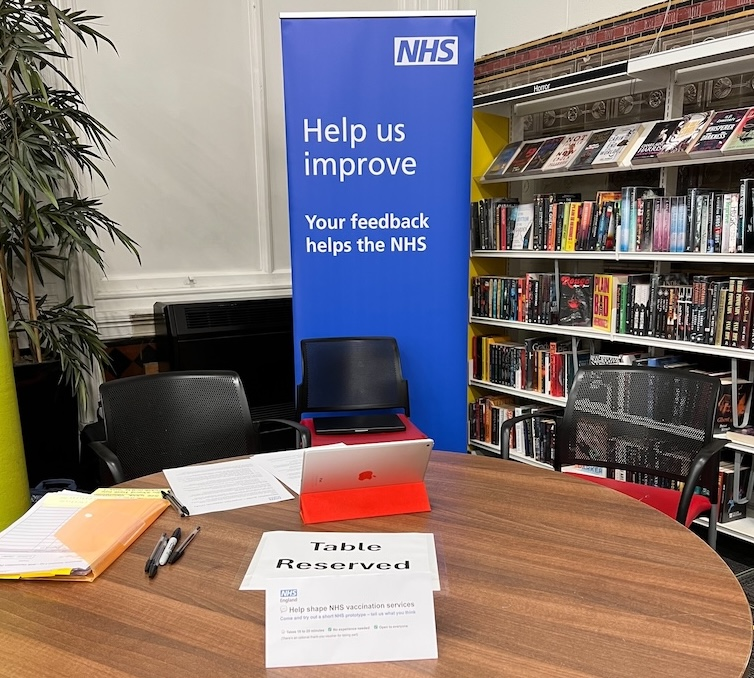

We were struggling to reach a diverse range of users through our NHS research panels. To fill the gaps, we took our research into public libraries — and learned things we would not have found any other way.

## Background

When designing a service that millions of people may use, getting a diverse range of research participants is essential. We formed a research plan that included people across several sub-groups, including:

- ethnic minorities
- people with lower digital confidence
- neurodivergent people
- people who use assistive technology such as screen readers
- people with long-term health conditions
- people for whom English is not a first language
- parents and carers

## The problem with panels

We used NHS research panels to survey people, recruit for interviews and co-design workshops, and run online prototype testing. The panels include a large number of volunteers and are an incredibly useful resource.

But after a few rounds of research, we noticed we were not getting the diversity of participants we needed. We had significant gaps across many of our target sub-groups, particularly ethnic minorities.

Remote methods alone were not going to get us there.

## **What we did**

To quote Steve Blank, author of The Lean Startup, we needed to _“get out of the building.”_

We contacted public libraries across different regions and asked if we could conduct pop-up research sessions for a day. Libraries were happy to support us. We set up a table with an NHS research banner and approached visitors, inviting them to take part in a 20-minute session.

We ran pop-up research at libraries in:

- East London
- Leeds
- Newcastle

### **Two-speed research sessions**

We ran two types of sessions in parallel, using two research teams:

- **fast team** — anonymous sessions lasting 5 to 10 minutes, with no demographic information captured, allowing us to speak with more people quickly
- **slow team** — fuller sessions lasting 15 to 20 minutes, including a short paper survey, a prototype usability test, and video and audio recording

In the slow sessions, we walked participants through consent, asked them to complete a short paper survey including their age group, asked a few questions about vaccinations, selected the right prototype scenario for their age group, and then asked them to use our prototype to check whether they should have the RSV vaccination.

We used the term "test version of the NHS App" rather than "prototype" — we found this was clearer and easier for participants to understand.

## **What we found**

### **What we learned about user needs**

Across the three library visits, we spoke with 26 people in research sessions. They included people from a mix of ethnicities, people with learning disabilities or difficulties, people with long-term health conditions, and people with lower levels of digital confidence — including one participant who comes into the library specifically to use a phone.

We learned participants need:

- to be notified when they’re eligible to get a vaccine - they expect someone will tell them
- a clear “yes or no” on whether they’re eligible
- clear, specific terms for describing vaccine categories - “catch-up” and “higher risk” were too broad to be understandable or useful
- simple content and messaging around vaccine information
- to see alternative options to booking an appointment online like finding a walk-in clinic

### What else we learned

**We uncovered barriers to using the NHS App**  
At Newcastle library, there is a community outreach team that helps people sign up for and use the NHS App. They saw our research request come through and set up a meeting with us to share the challenges people face. This was a connection we would not have made through remote research.

**We learned that libraries run digital drop-in sessions**  
At Leeds library, our pop-up session coincided with a [digital drop-in session](https://libraries.leeds.gov.uk/find-information/digital-support) running to help people with digital devices. Several attendees were willing to participate in our research, giving us access to people at the lower end of the digital confidence spectrum.

## How this changes our approach

This research directly informed several changes we are making or exploring:

**Using the eligibility ["care card" pattern](https://service-manual.nhs.uk/design-system/patterns/help-users-decide-when-and-where-to-get-care) across all vaccines.** Participants found this pattern clear and easy to read, so we are continuing to use it beyond RSV.

**Removing "catch-up" and "higher risk" vaccine categories for now.** The terms were too broad to be meaningful to people. We need to iterate on the design and content for these categories and test them further before bringing them back.

**Adding RSV vaccine app notifications to our roadmap.** Most people expected the NHS to proactively tell them when they were eligible. Unlike COVID-19 and flu, RSV is available year-round, so we’ll look at how we notify people as soon as they become eligible.

**Showing all options for getting vaccinated, not just online booking.** People need to know about alternatives like walk-in clinics. We are updating the service to surface these alongside the online booking journey.

## **What we would do differently**

One challenge was that very few participants were in our target age range of 75 to 79. Finding specific people in public spaces is difficult. We plan to visit GP practices and pharmacies as a way to speak with older adults about vaccinations in the NHS App.

## **Tips for running pop-up research**

If you are considering taking your research into public spaces, here is what we learned from running these sessions:

- **expect a lot of "no"s** — many people will decline, especially at first - keep going. There are plenty of people who are happy to help.
- **have a visible sign or banner** — it attracts attention and gives people a quick way to understand what you are doing.
- **involve library staff** — they are often interested and willing to help. Some helped recruit by mentioning the research to visitors at the front desk.
- **look for libraries with high footfall** — libraries that host other services nearby work well. Newcastle City Library, for example, has a Citizens Advice and a UK Visa and Immigration Service on site.
- **use the library's digital sessions** — if a library already runs drop-in sessions to help people get online, these are a good way to reach participants with low digital confidence.
- **use iOS screen recording** — it is built in and free, and captures audio alongside the screen. Be aware that audio quality can be affected in noisy environments.
- **use "test version" not "prototype"** — not everyone knows what a prototype is. "Test version of the NHS App" was clear and easy for participants to understand.
