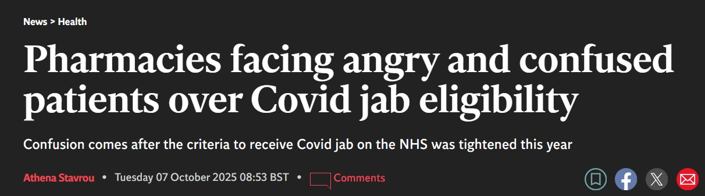

**This autumn, as the COVID-19 vaccination programme launched, our digital services team needed to move quickly to respond to unexpected confusion around eligibility.**

We needed to help reduce pressure on community pharmacies and restore clarity for patients.

## What happened

This year, the Joint Committee on Vaccination and Immunisation (JCVI) changed eligibility rules for COVID-19 boosters.

The age threshold rose from **65 to 75**, meaning many people who had qualified last year were no longer eligible.

[Despite clear guidance on NHS.UK](https://www.nhs.uk/vaccinations/covid-19-vaccine/) and GOV.UK, the shift caught many off guard. Here's what some users told us in the booking exit survey (1 Sept to 5 October):

> I do not understand why I do not qualify too, especially as I am 67

> If something has changed, it would be kind to inform people that they are no longer at significant risk

Pharmacies saw a surge in patients who expected to receive a vaccine but were turned away.

This led to frustration and anger - especially among those unaware of the updated rules.  It also caused stress and disruption for pharmacy teams, who were already under pressure during a busy period.

## What we did

We - Vaccination Digital Services - acted quickly to support patients and pharmacy teams, by:

- **sending targeted follow-up messages** to around 250,000 people under 75 with upcoming bookings, explaining the updated eligibility rules and setting expectations
- **updating confirmation messages in the booking service** to reinforce the change
- **working with Community Pharmacy England** to create [resources to help pharmacy teams](https://cpe.org.uk/our-news/c-19-vac-eligibility-resources-to-help-pharmacy-teams/)
- **adding a warning to the** [flu booking start page](https://www.nhs.uk/nhs-services/vaccination-and-booking-services/book-flu-vaccination/), reminding users to check COVID-19 eligibility before booking
- **updating national invitations** to make the change in eligibility clearer

Mindful of the frustration people were feeling, we wanted the tone of our email to reflect that. It was a slight shift from our [usual voice](https://service-manual.nhs.uk/content/voice-and-tone) - more empathetic, more human - and it felt right for the moment:

> We understand this might be confusing, especially if you had the vaccine last year.

## What we know
### Many people go straight for the green button

While the COVID-19 vaccination booking service automatically screens out users who are not eligible by age, the [flu vaccination booking service](https://www.nhs.uk/nhs-services/vaccination-and-booking-services/book-flu-vaccination/) allows users to **self-refer** for a COVID-19 booster if they believe they meet the criteria.

This is needed because many people want the convenience of arranging both vaccinations in one go - ideally to have at the same appointment. We need to make that process as smooth as possible for those who are eligible.

We made the criteria as clear as possible, using a prominent yellow [warning callout](https://service-manual.nhs.uk/design-system/components/warning-callout). But it's possible many people simply didn't read this or understand it, or just clicked through anyway.

> No proper information on eligibility. Just a yes/no question

> I wanted to see more detail on eligibility criteria

We're waiting for more data to back this assumption - but this is something researchers see time and again: users skip the content and head straight for the green button — and designers always have to plan for it.

[We saw this pattern in the COVID testing service too](https://digital.nhs.uk/blog/design-matters/2022/covid-19-testing-tackling-eligibility): once users are familiar with a digital service and have seen an interruption screen before, they're more likely to ignore it, even if content has changed. They assume they've read it before.

### 'Immunosuppressed' is a grey area

But it's likely the confusion wasn't *just* about age.

Every season, it seems that some patients self-refer believing they have a weakened immune system that qualifies them for the jab -  but in fact they do not, or no longer, meet the criteria. For example, someone who recently came off treatment might not realise they're no longer eligible.

> I’m asthmatic. Got to the time section. Got thrown off. Filled out details and said not eligible. I've had it every year for as long as I remember.

> I have to rank as very [disappointed] as I find I am not eligible despite a number of health conditions including cardiac, respiratory and diabetes.

> Incomplete list of immune conditions left me uncertain as to whether I am eligible or not

It's always a challenge to help people determine whether they have a weakened immune system because of a health condition or treatment, because this is ultimately determined by a clinician. We can't publish a definitive list for people to check against, only [a summary](https://www.nhs.uk/vaccinations/covid-19-vaccine/).

## What we've learned - and what we'll do next time

But let's focus on what we can do.

Now we know: **when eligibility rules change, clarity matters more than ever.**

We've learned that:
- people often don’t read content, especially if they’ve seen similar screens before
- even well-placed messaging can be missed or misunderstood
- many people don't know if they qualify for an NHS vaccination

And next time, we will:
- **convey that things have *changed***, not just what the new rules are
- **personalise communications** where possible (e.g. “Because you’re under 75…”)
- **align national messaging and digital services** more closely to set expectations

These lessons will shape how we communicate eligibility in future campaigns, and in the upcoming [Check and book an RSV vaccination service](https://www.service-catalogue.nhs.uk/services/check-my-vaccination-record) in the NHS App, currently in alpha.

We're constantly learning and improving how we design digital services. As we work to increase uptake of seasonal vaccinations, we also have a responsibility to support those who are no longer eligible - with clear, compassionate communication that helps everyone understand where they stand.

